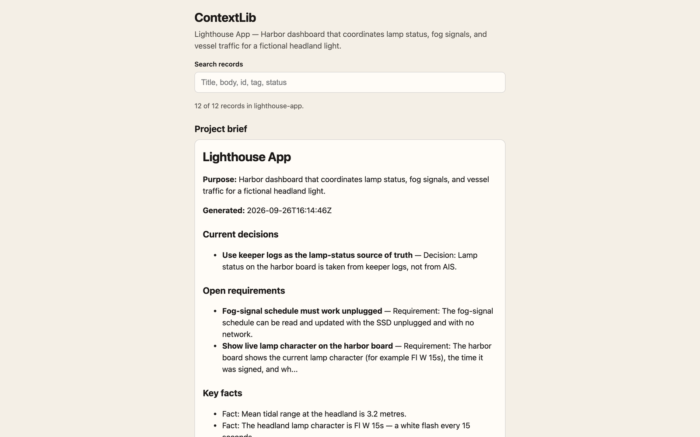
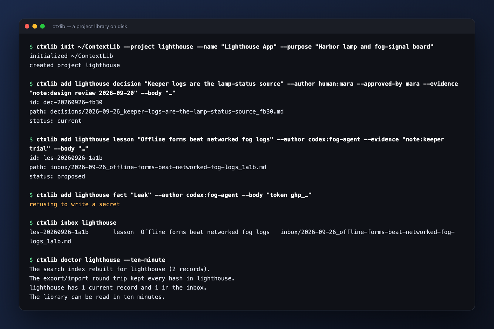

# ContextLib

**A project library that outlives every agent session.**



<sub>Real screenshot of the sample library (an invented project).</sub>

<table><tr><td width="50%"><br><sub>A ctxlib session: an owner's decision lands current, an agent's lesson waits in the inbox, a secret is refused, and doctor passes.</sub></td></tr></table>

Each project's knowledge — decisions, requirements, facts, lessons, glossary, sources and returned work — is stored as plain Markdown files with a small front-matter block, in one folder per project. The folders can sit on an external SSD. A person can understand a project from Finder alone. Agents read and write the same files through a CLI (`ctxlib`) and an MCP server (`context_*` tools). Any database is a search index rebuilt from the files, never the source of truth.

It is the open core of the context plugin of [AgentBrain](https://agentrooms.io).

The Python package is `agentbrain_contextlib`. The CLI is `ctxlib`. Python 3.9+, standard library only. Git is optional.

## Why

Agent sessions end. Chat logs drift. A store that only a model can parse is a dead end the first time you open Finder on an airplane.

ContextLib keeps the durable layer as files you can read, diff, copy, and take to another Mac. The search index is disposable. The Markdown is the product.

## 60-second quickstart

```bash
pip install "git+https://github.com/willykeenan/agentbrain-contextlib"

ctxlib init ~/ContextLib --project lighthouse-app \
  --name "Lighthouse App" \
  --purpose "Harbor dashboard for lamp status, fog signals, and traffic"

ctxlib add lighthouse-app decision "Use keeper logs as lamp status" \
  --body "**Decision:** Lamp status comes from keeper logs, not AIS." \
  --author mara \
  --tag lamp --tag keeper-log

ctxlib brief lighthouse-app
ctxlib doctor lighthouse-app --ten-minute
```

The library path is `--library PATH`, else env `CONTEXTLIB_ROOT`, else `~/ContextLib`.

A finished sample you can open in Finder without installing anything lives at [`examples/sample-library/`](examples/sample-library/). Start at that README, then the project BRIEF, then `decisions/INDEX.md`.

Full walkthrough: [docs/QUICKSTART.md](docs/QUICKSTART.md).

## CLI (`ctxlib`)

```
ctxlib [--library PATH] COMMAND
```

| Command | What it does |
| --- | --- |
| `init PATH [--project SLUG --name NAME --purpose TEXT]` | Create a library (and optionally the first project) |
| `project add SLUG NAME [--purpose]` | Add a project folder |
| `project list` | List projects |
| `add PROJECT TYPE TITLE (--body TEXT \| --body-file F) --author ID [options]` | Write a record (`--evidence`, `--tag`, `--review-by`, `--approved-by`) |
| `get PROJECT ID` | Print one record, with evidence state and supersession chain |
| `search PROJECT QUERY [--type] [--all]` | Search the rebuildable index |
| `brief PROJECT` | Print the always-loaded summary (≤ 8192 bytes) |
| `supersede PROJECT OLD NEW --reason TEXT --author ID` | Mark old superseded, move the file, keep the body hash |
| `review PROJECT ID confirm\|retire --note TEXT --author ID` | Confirm or retire a record |
| `inbox PROJECT` | List proposed records |
| `accept PROJECT ID --author ID` | Move inbox → current |
| `reject PROJECT ID --reason TEXT --author ID` | Move inbox → rejected |
| `due PROJECT` | Records whose `review_by` is due |
| `regen PROJECT\|--all` | Rewrite BRIEF, INDEX, GLOSSARY, TIMELINE, README |
| `rebuild` | Rebuild the SQLite search index from files |
| `capture PROJECT RESULT.json` | Turn a result file into a `return` (and proposed lessons) |
| `import-md PROJECT FILE --type TYPE --author ID` | Markdown file → record |
| `export PROJECT OUT_DIR [--include-private]` | Zip a project |
| `import BUNDLE` | Import a zip |
| `doctor [PROJECT] [--ten-minute]` | Plain-English health check |
| `sync` | `git pull` / `git push` when the library is a git repo; otherwise a no-op with a message |
| `mcp --identity ID` | Stdio MCP server; the identity is fixed for the process |

Types: `decision`, `requirement`, `fact`, `lesson`, `glossary`, `source`, `return`, `brief-note`.

## MCP (`context_*` tools)

`ctxlib mcp --identity ID` is a stdio JSON-RPC server. Protocol versions: `2024-11-05`, `2025-03-26`, `2025-06-18`.

Tools: `context_brief`, `context_search`, `context_get`, `context_record`, `context_supersede`, `context_review_due`, `context_review`, `context_capture`, `context_export`, `context_import`, `context_status`.

The identity is fixed at start. Tools cannot write as another identity. Errors come back as `isError` results.

### Claude Code

```json
{
  "mcpServers": {
    "contextlib": {
      "command": "ctxlib",
      "args": ["mcp", "--identity", "claude:project"],
      "env": { "CONTEXTLIB_ROOT": "/Volumes/SSD/ContextLib" }
    }
  }
}
```

### Codex

```json
{
  "mcpServers": {
    "contextlib": {
      "command": "ctxlib",
      "args": ["mcp", "--identity", "codex:project"],
      "env": { "CONTEXTLIB_ROOT": "/Volumes/SSD/ContextLib" }
    }
  }
}
```

### Cursor

In `.cursor/mcp.json` (project) or `~/.cursor/mcp.json` (user):

```json
{
  "mcpServers": {
    "contextlib": {
      "command": "ctxlib",
      "args": ["mcp", "--identity", "cursor:project"],
      "env": { "CONTEXTLIB_ROOT": "/Volumes/SSD/ContextLib" }
    }
  }
}
```

Details: [docs/MCP.md](docs/MCP.md).

## Record format

A record is UTF-8 Markdown. It starts with a YAML-like front-matter block (scalars, quoted strings, lists of scalars, lists of flat maps) and a Markdown body. The body hash is stored in the front-matter; bodies are not rewritten.

```
---
id: dec-20260926-7f3a
type: decision
title: Use plain files as the source of truth
status: current
project: lighthouse-app
scope: {lane: workstream, team: owner}
created: 2026-09-26T14:03:00Z
author: mara
approved_by: mara — "files first, database is only an index"
evidence:
  - {ref: "project:BRIEF.md"}
  - {ref: "url:https://example.com/x"}
supersedes: []
superseded_by: null
review_by: 2027-03-25
tags: [storage, library]
sensitivity: normal
body_sha256: "…"
---
**Decision:** …
**Why:** …
**Consequences:** …
**How to verify:** …
```

Evidence refs are `project:<relative path>`, `ssd:<relative path>`, `room:<name>#<seq>`, `url:<https url>`, or `note:<text>`. Absolute home paths and secrets are refused at write time.

Ids: `<prefix>-<YYYYMMDD>-<4 hex>` with prefixes `dec`, `req`, `fact`, `les`, `glo`, `src`, `ret`, `note`.

Files: `<YYYY-MM-DD>_<title-slug>_<id-suffix>.md`. Superseded records move to `superseded/` with the body hash still valid.

## Library layout

```
<library root>/
├── README.md              how to read this in 10 minutes
├── INDEX.md               one line per project
├── library.json           {"format": "contextlib/1", "library_id", "created"}
└── projects/<slug>/
    ├── README.md BRIEF.md GLOSSARY.md TIMELINE.md project.json
    ├── decisions/ requirements/ facts/ lessons/ glossary/ sources/ returns/
    │   ├── INDEX.md
    │   ├── <YYYY-MM-DD>_<title-slug>_<id-suffix>.md
    │   └── superseded/
    ├── inbox/             proposed records
    ├── exports/
    └── .contextlib/       ledger + rebuildable index.sqlite
```

Keeping the library on an SSD, using it unplugged, and moving it between Macs: [docs/SSD.md](docs/SSD.md).

## Develop

```bash
PYTHONPATH=src python3 -m unittest discover -s tests
python3 tools/check.py packaging
```

Python 3.9+, standard library only. See [CONTRIBUTING.md](CONTRIBUTING.md) and [CHANGELOG.md](CHANGELOG.md).

Apache-2.0, copyright KE Studios. [SECURITY.md](SECURITY.md) for reports.

ContextLib is the open library layer of AgentBrain (agentrooms.io).
